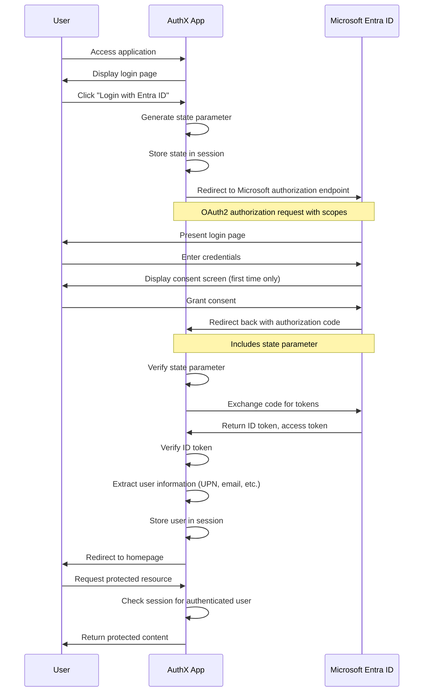
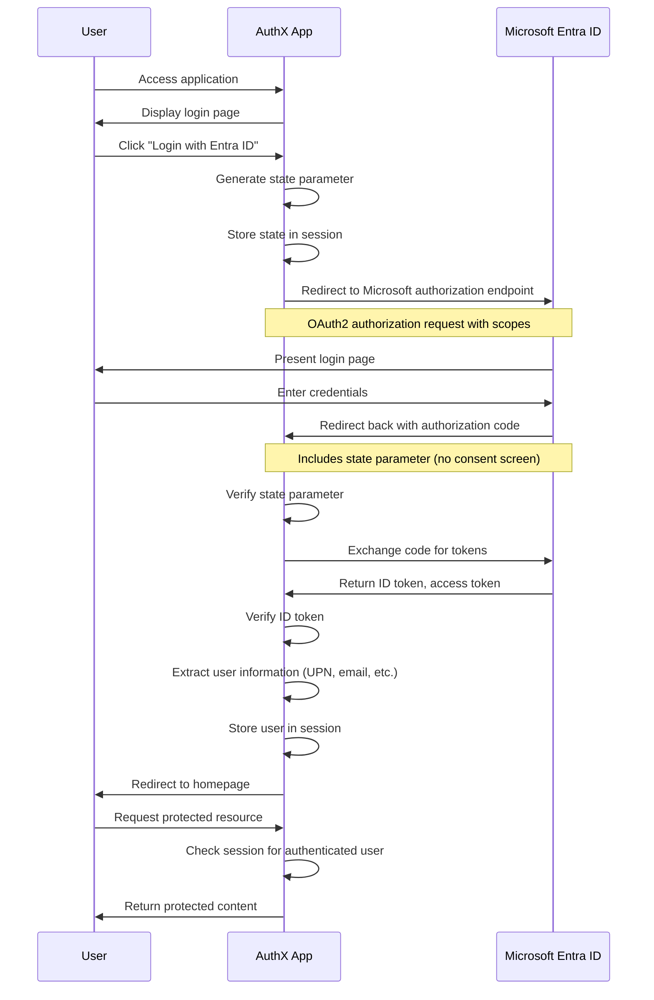
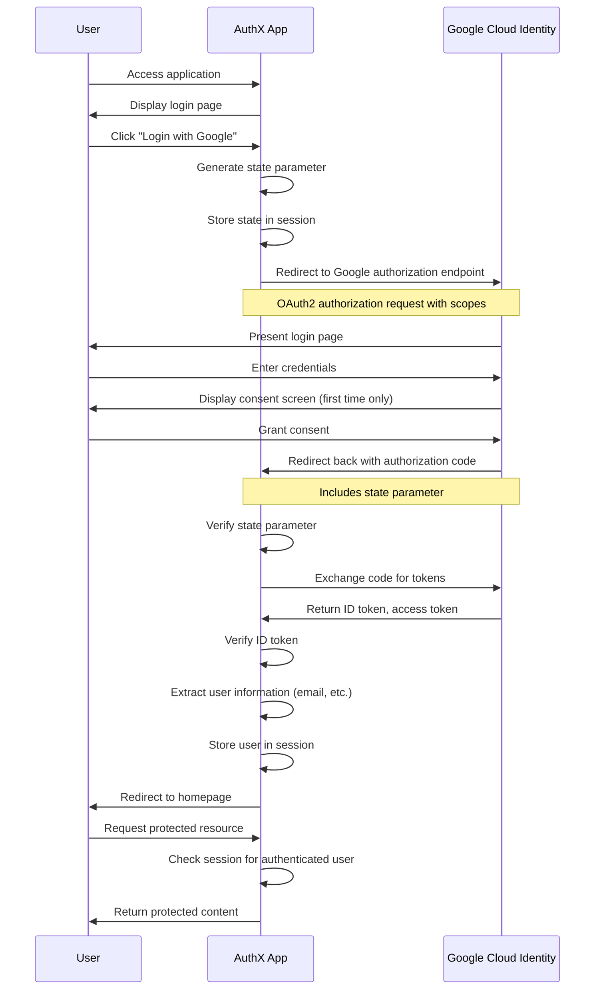

# Authentication for multi-tenant SaaS

Example of multi-tenant application supporting both Microsoft Entra ID and Google Cloud Identity.

# Components
A multi-tenant application that is configured in one tenant. Each client must add the client to its tenant, either through using the OAuth Consent Flow natively in Entra ID/Google Cloud, or through installing the application manually.

The multi-tenant application will be provided as a Verified Application.

The backend application can validate the claims of each user:

```
2025/05/20 13:31:50 === Verified ID Token Info ===
2025/05/20 13:31:50 Issuer: https://login.microsoftonline.com/2313d7a5-6ee4-41b8-9aac-d2027a25f74a/v2.0
2025/05/20 13:31:50 Audience: [e44dca09-36d1-4eb3-8a36-f61cf9a3f420]
2025/05/20 13:31:50 Subject: adrfgtejqwdajefwrgt6yadjjwjaq3dfDNBFawdjq
2025/05/20 13:31:50 Expiry: 2025-05-20 14:31:50 +0200 CEST
2025/05/20 13:31:50 Issued At: 2025-05-20 13:26:50 +0200 CEST
2025/05/20 13:31:50 === Parsed User Claims ===
2025/05/20 13:31:50 {
  "sub": "adrfgtejqwdajefwrgt6yadjjwjaq3dfDNBFawdjq",
  "email": "karim@dummy.no",
  "preferred_username": "karim@dummy.no",
  "name": "Karim El-Melhaoui",
  "tid": "2313d7a5-6ee4-41b8-9aac-d2027a25f74a"
}
2025/05/20 13:31:50 === All Available Claims ===
2025/05/20 13:31:50 {
  "aud": "e44dca09-36d1-4eb3-8a36-f61cf9a3f420",
  "email": "karim@dummy.no",
  "exp": 1747744310,
  "iat": 1747740410,
  "iss": "https://login.microsoftonline.com/2313d7a5-6ee4-41b8-9aac-d2027a25f74a/v2.0",
  "name": "Karim El-Melhaoui",
  "nbf": 1747740410,
  "oid": "729f2ee4-b1f3-44ac-8d9d-ac823289f4b2",
  "preferred_username": "karim@dummy.no",
  "rh": "1.AU4ApdcTI-ADWJfjewsjdwjahjefhhqDEFWR.",
  "sid": "004f6069-ad7d-0c6a-c4e1-dwadawdfhtgh",
  "sub": "adrfgtejqwdajefwrgt6yadjjwjaq3dfDNBFawdjq",
  "tid": "111111-6ee4-41b8-9aac-23daudd321d43",
  "uti": "x-Y10YjNFEWtPuuAwe1AAA",
  "ver": "2.0"
}
```

## Authentication Flow

### Microsoft Entra ID

If application has not been consented (requires global admin):



If application has already been consented:



### Google Cloud Identity



## Identity Provider Setup

### Microsoft Entra ID

#### Manually installing the application

Register the multi-tenant application in your tenant:

```bash
az rest --method POST \
  --uri https://graph.microsoft.com/v1.0/servicePrincipals \
  --headers 'Content-Type=application/json' \
  --body '{"appId": "e44dca09-36d1-4eb3-8a36-f61cf9a3f420"}'
```

Find the client id for your Microsoft Graph application, this is unique to each tenant:
```bash
az rest --method GET \
  --uri "https://graph.microsoft.com/v1.0/servicePrincipals?\$filter=appId eq '00000003-0000-0000-c000-000000000000'" \
  --query "value[0].id" -o tsv
```

Find the Object ID of the installed application in your tenant, provide this for the clientId parameter below and provide the client id for your Microsoft Graph application
```bash
az rest --method POST \
  --uri https://graph.microsoft.com/v1.0/oauth2PermissionGrants \
  --headers 'Content-Type=application/json' \
  --body '{
    "clientId": ">application id of multi-tenant app installed in your tenant>",
    "consentType": "AllPrincipals",
    "principalId": null,
    "resourceId": "<client id for Microsoft Graph application in your tenant>",
    "scope": "User.Read"
  }'
```

### Google Cloud Identity

To set up Google Cloud Identity for the application:

1. Go to the Google Cloud Console
2. Navigate to APIs & Services > Credentials
3. Create an OAuth client ID
4. Configure the authorized redirect URIs
5. Note your client ID and client secret

Configure your application with the Google OAuth 2.0 endpoints:
- Authorization endpoint: https://accounts.google.com/o/oauth2/v2/auth
- Token endpoint: https://oauth2.googleapis.com/token
- Required scopes: openid email profile

## Claims Comparison

| Information | Microsoft Entra ID | Google Cloud Identity |
|-------------|-------------------|----------------------|
| User ID     | "sub" claim       | "sub" claim          |
| Email       | "email" claim     | "email" claim        |
| Name        | "name" claim      | "name" claim         |
| Username    | "preferred_username" | "email" claim     |
| Tenant ID   | "tid" claim       | N/A                  |

